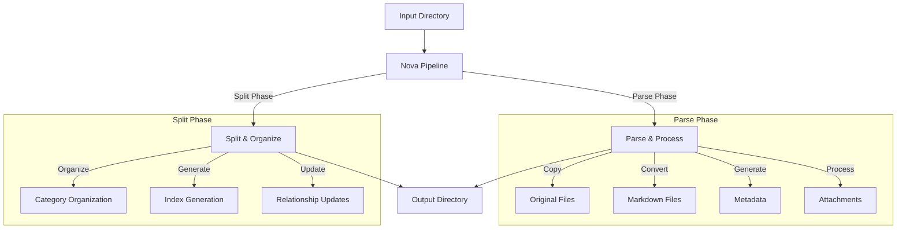
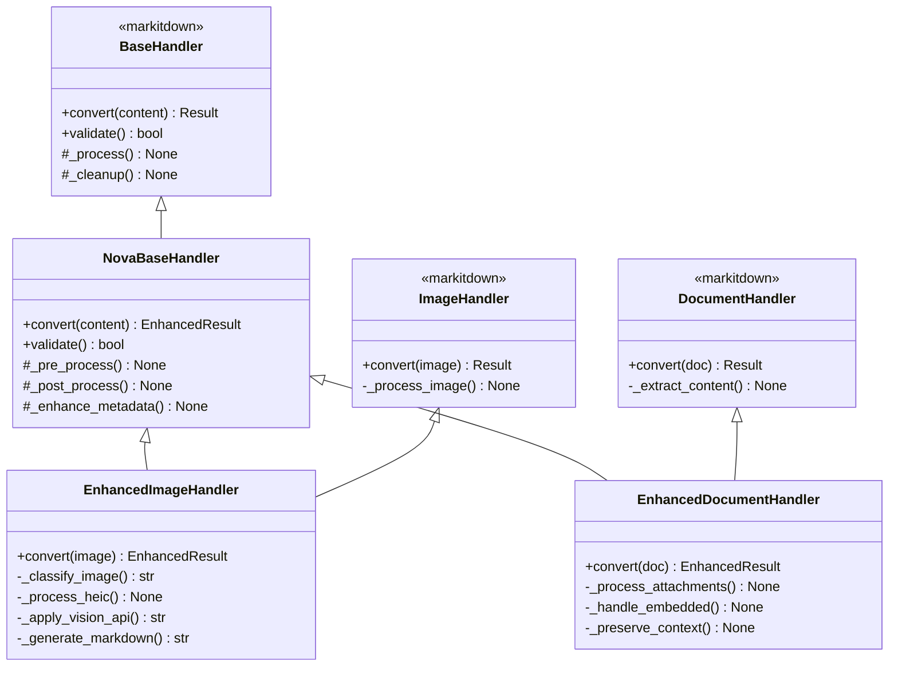
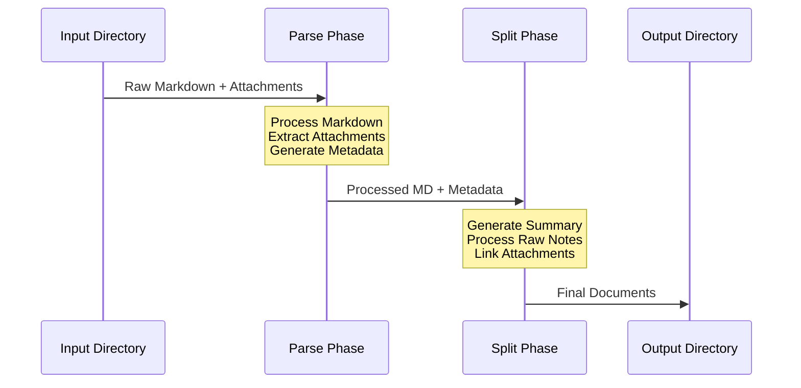

# Nova System Architecture

## Table of Contents
1. [System Overview](#system-overview)
2. [High-Level Architecture](#high-level-architecture)
3. [Core Components](#core-components)
4. [Handler Extension Architecture](#handler-extension-architecture)
5. [Pipeline Specification](#pipeline-specification)
6. [Data Flow & Directory Structure](#data-flow--directory-structure)
7. [Technology Stack](#technology-stack)
8. [Error Handling](#error-handling)
9. [Implementation Guidelines](#implementation-guidelines)
10. [Security & Performance](#security--performance)

## System Overview

Nova is a document processing pipeline designed to transform Markdown documents with embedded content into structured, interlinked outputs. The system follows a phase-based architecture with clear boundaries between components and well-defined data flows.

## High-Level Architecture



## Core Components

### 1. Pipeline Runner (run_nova.sh)
- Single entry point for processing
- Handles configuration loading
- Manages pipeline execution
- Provides progress feedback
- Handles error reporting

### 2. Directory Structure
```
_NovaProcessing/
├── original/          # Original files preserved
├── markdown/          # Markdown representations
├── metadata/          # File metadata
├── attachments/       # Processed attachments
└── [categories]/      # Organized output
    └── index.md      # Category indexes
```

### 3. Phase Implementation
- **Parse Phase**
  - Preserves original files
  - Converts to markdown
  - Processes attachments
  - Generates metadata
  - Updates links

- **Split Phase**
  - Organizes files by category
  - Generates indexes
  - Updates relationships
  - Consolidates metadata

## Handler Extension Architecture

### Overview



### Handler Extension Pattern

1. **Base Handler Extension**
```python
from markitdown.handlers import BaseHandler
from typing import Optional, Dict, Any

class NovaBaseHandler(BaseHandler):
    """Base handler extending markitdown's functionality."""
    
    def __init__(self, config: Dict[str, Any]):
        super().__init__()
        self.config = config
        self.metadata = {}
        
    def convert(self, content: Any) -> 'EnhancedResult':
        """Enhanced conversion with pre/post processing."""
        self._pre_process(content)
        result = super().convert(content)
        enhanced_result = self._post_process(result)
        return enhanced_result
        
    def _pre_process(self, content: Any) -> None:
        """Pre-processing hook for enhanced handlers."""
        pass
        
    def _post_process(self, result: 'Result') -> 'EnhancedResult':
        """Post-processing hook for enhanced handlers."""
        pass
        
    def _enhance_metadata(self) -> Dict[str, Any]:
        """Add Nova-specific metadata."""
        pass
```

2. **Enhanced Image Handler - Production Implementation**
```python
class ImageHandler(BaseHandler):
    """Handler for image files with vision API integration."""
    
    def __init__(self, config: ConfigManager) -> None:
        super().__init__(config)
        self.openai_client = None
        self.openai_model = "gpt-4o"  # Verified working model
        self.openai_max_tokens = None
        
        # Initialize OpenAI with proper error handling
        if hasattr(config.config, 'apis') and hasattr(config.config.apis, 'openai'):
            openai_config = config.config.apis.openai
            api_key = os.environ.get('OPENAI_API_KEY') or getattr(openai_config, 'api_key', None)
            
            if api_key:
                self.openai_client = openai.OpenAI(api_key=api_key)
                self.openai_max_tokens = getattr(openai_config, 'max_tokens', 500)
                
    async def _get_image_context(self, image_path: Path) -> str:
        """Production-verified image context retrieval."""
        if not self.openai_client:
            return self._get_basic_image_info(image_path)
            
        try:
            # Handle HEIC conversion if needed
            image_path = await self._handle_heic_conversion(image_path)
            
            # Process with Vision API
            base64_image = self._get_base64_image(image_path)
            return await self._call_vision_api(base64_image)
            
        except (openai.RateLimitError, 
                openai.AuthenticationError, 
                openai.APIError) as api_error:
            self.logger.error(f"API error: {str(api_error)}")
            return f"No context available - {str(api_error)}"
            
        except Exception as e:
            self.logger.error(f"Processing error: {str(e)}")
            return "No context available - Image processing error"
```

**Key Implementation Points**:
1. Use of `gpt-4o` model for reliable vision processing
2. Robust error handling for API and processing failures
3. HEIC format support with conversion
4. Proper cleanup of temporary files
5. Graceful fallback to basic image info when API unavailable
6. Clear separation of concerns in processing steps
7. Comprehensive logging for debugging
8. Memory-efficient base64 encoding
9. Proper async/await pattern usage
10. Secure API key handling

3. **Enhanced Document Handler**
```python
class EnhancedDocumentHandler(NovaBaseHandler):
    """Extended document handler with attachment support."""
    
    def convert(self, document: bytes) -> 'EnhancedResult':
        """Process document with attachment handling."""
        attachments = self._process_attachments(document)
        embedded = self._handle_embedded(document)
        
        base_result = super().convert(document)
        
        context = self._preserve_context(
            base_result,
            attachments,
            embedded
        )
        
        return EnhancedResult(
            markdown=base_result.markdown,
            metadata=self._enhance_metadata(),
            context=context
        )
```

### Handler Registration

```python
from markitdown import MarkItDown
from nova.handlers import EnhancedImageHandler, EnhancedDocumentHandler

def register_handlers(md: MarkItDown, config: Dict[str, Any]) -> None:
    """Register Nova's enhanced handlers with markitdown."""
    md.register_handler(
        "image",
        EnhancedImageHandler(config["image_handler"])
    )
    md.register_handler(
        "document",
        EnhancedDocumentHandler(config["document_handler"])
    )
```

### Handler Configuration

```yaml
handlers:
  image_handler:
    vision_api:
      provider: "openai"
      model: "gpt-4-vision-preview"
      fallback_provider: "xai"
    classification:
      model: "resnet50"
      confidence_threshold: 0.85
    heic:
      quality: 85
      output_format: "jpeg"
    
  document_handler:
    attachment_processing:
      enabled: true
      recursive: true
      max_depth: 3
    context_preservation:
      enabled: true
      metadata_format: "json"
```

### Result Types

```python
from dataclasses import dataclass
from typing import Optional, Dict, Any

@dataclass
class EnhancedResult:
    """Extended result type with additional metadata."""
    markdown: str
    metadata: Dict[str, Any]
    context: Optional[Dict[str, Any]] = None
    original_result: Optional['Result'] = None
    processing_history: Optional[Dict[str, Any]] = None
```

### Handler Lifecycle

1. **Initialization**
   - Load configuration
   - Initialize API clients
   - Set up processing tools

2. **Pre-processing**
   - Format detection
   - Content validation
   - Resource preparation

3. **Base Processing**
   - Call markitdown's base handler
   - Capture base result
   - Preserve original metadata

4. **Enhancement**
   - Apply additional processing
   - Generate enhanced content
   - Create extended metadata

5. **Post-processing**
   - Clean up resources
   - Cache results if needed
   - Update processing history

### Error Handling

```python
class HandlerError(Exception):
    """Base class for handler errors."""
    pass

class PreProcessError(HandlerError):
    """Error during pre-processing stage."""
    pass

class EnhancementError(HandlerError):
    """Error during enhancement stage."""
    pass

class PostProcessError(HandlerError):
    """Error during post-processing stage."""
    pass
```

## Pipeline Specification

### Pipeline Overview



### Phase 1: Parse

#### Processing Steps
1. **Document Loading**
   - Read Markdown content
   - Detect embedded content markers
   - Identify attachment references

2. **Attachment Processing**
   - Extract embedded content
   - Convert attachments to Markdown
   - Process images and documents
   - Generate attachment metadata

3. **Metadata Generation**
   - Create document structure metadata
   - Record attachment relationships
   - Generate processing history
   - Create link references

#### Metadata Schema
```json
{
  "document": {
    "id": "unique_identifier",
    "source_path": "relative/path/to/source.md",
    "file_metadata": {
      "created_at": "2024-01-09T10:00:00Z",
      "modified_at": "2024-01-09T11:30:00Z",
      "hash": "sha256_hash_of_content",
      "size_bytes": 12345,
      "original_name": "document.md"
    },
    "processing_metadata": {
      "parse_timestamp": "2024-01-09T12:00:00Z",
      "parser_version": "0.0.1a3",
      "cache_status": {
        "is_cached": true,
        "cache_date": "2024-01-09T12:00:00Z",
        "cache_valid": true,
        "invalidation_reason": null
      }
    },
    "sections": {
      "summary": {
        "start_line": 1,
        "end_line": 41,
        "attachments": ["ref1", "ref2"],
        "word_count": 250,
        "reading_time_minutes": 2
      },
      "raw_notes": {
        "start_line": 43,
        "end_line": 142,
        "attachments": ["ref3", "ref4"],
        "word_count": 800,
        "reading_time_minutes": 6
      }
    },
    "attachments": [
      {
        "id": "ref1",
        "type": "image",
        "original_path": "path/to/original",
        "processed_path": "path/to/processed",
        "metadata_path": "path/to/metadata",
        "file_metadata": {
          "created_at": "2024-01-09T09:00:00Z",
          "modified_at": "2024-01-09T09:00:00Z",
          "hash": "sha256_hash_of_content",
          "size_bytes": 54321
        },
        "image_processing": {
          "original_format": "HEIC",
          "converted_format": "JPEG",
          "conversion_timestamp": "2024-01-09T12:00:00Z",
          "classification": {
            "type": "screenshot",
            "confidence": 0.95,
            "detected_elements": ["text", "ui_components"]
          },
          "ocr_results": {
            "text": "Extracted text content...",
            "confidence": 0.92,
            "format_preserved": true
          },
          "vision_api": {
            "provider": "openai",
            "model": "gpt-4-vision-preview",
            "description": "A detailed description of the image...",
            "processing_timestamp": "2024-01-09T12:00:05Z",
            "cache_key": "hash_of_image_content",
            "confidence_score": 0.95,
            "context_analysis": {
              "type": "technical_screenshot",
              "relevance": "Shows system configuration settings",
              "key_points": [
                "Configuration panel visible",
                "Important settings highlighted"
              ]
            }
          }
        },
        "cache_info": {
          "is_cached": true,
          "cache_date": "2024-01-09T12:00:00Z",
          "cache_key": "unique_cache_identifier",
          "dependencies": ["vision_api_response", "ocr_results"]
        }
      }
    ],
    "link_map": {
      "ref1": {
        "id": "ref1",
        "title": "Configuration Screenshot",
        "anchor": "configuration-screenshot",
        "references": [
          {
            "type": "summary",
            "link": "../summary.md#configuration-section",
            "context": "Configuration setup details"
          },
          {
            "type": "raw_notes",
            "link": "../raw_notes.md#initial-setup",
            "context": "Initial system configuration"
          }
        ]
      }
    }
  }
}
```

### Phase 2: Split

#### Processing Steps
1. **Content Analysis**
   - Read metadata files
   - Identify document sections
   - Map attachment relationships

2. **Document Generation**
   - Extract and combine summaries
   - Consolidate raw notes
   - Process attachment references

3. **Link Creation**
   - Generate bidirectional links
   - Update document references
   - Create navigation structure

#### Output Document Structure
1. **summary.md**
   ```markdown
   # Summary Document
   
   ## Document 1 Summary
   [Content with links to attachments]
   
   ## Document 2 Summary
   [Content with links to attachments]
   ```

2. **raw_notes.md**
   ```markdown
   # Raw Notes
   
   ## Document 1 Notes
   [Content with links to attachments and summaries]
   
   ## Document 2 Notes
   [Content with links to attachments and summaries]
   ```

3. **attachments.md**
   ```markdown
   # Attachments
   
   ## Document 1 Attachments
   - [Attachment 1](link) - Referenced in [Summary](link)
   - [Attachment 2](link) - Referenced in [Raw Notes](link)
   ```

## Data Flow & Directory Structure

### Input Structure
```
_NovaInput/
└── document.md (with embedded content)
│   └── document/
│       ├── attached1.doc
│       ├── attached2.jpg
│       └── attached3.pdf
```

### Processing Structure
```
_NovaProcessing/
├── phases/
│   └── parse/
│       ├── document.md
│       ├── metadata.json
│       └── document/
│           ├── attached1.md
│           ├── attached2.md
│           └── attached3.md
│           └── embeddedattached.md
├── images/
│   ├── original/
│   └── processed/
└── metadata/
```

### Output Structure
```
_Nova/
├── summary.md
├── raw_notes.md
└── attachments.md
```

## Technology Stack

### Core Dependencies
1. **Python Environment**
   - Python 3.11.7+
   - Poetry for dependency management

2. **Document Processing**
   - markitdown==0.0.1a3 (Markdown processing)
   - pillow>=10.1.0 (Image processing)
   - pyheif>=0.7.1 (HEIC support)
   - openai>=1.3.5 (Vision API)
   - xai-client>=1.0.0 (xAI Vision API)

3. **Configuration**
   - YAML for configuration files
   - JSON for metadata storage

4. **Image Processing**
   - ImageMagick 6.x (via system)
   - libheif (via system)

### Development Tools
1. **Testing**
   - pytest for unit/integration tests
   - No coverage tracking

2. **Code Quality**
   - Type hints
   - Docstring documentation
   - Error handling patterns

## Error Handling

### Error Categories
1. **Parse Phase Errors**
   - Invalid Markdown syntax
   - Attachment conversion failures
   - Missing references

2. **Split Phase Errors**
   - Metadata inconsistencies
   - Link resolution failures
   - Content consolidation issues

### Recovery Mechanisms
1. **Processing State**
   - Track file progress
   - Monitor phase completion
   - Handle interruptions

2. **Error Recovery**
   - Partial processing resume
   - State restoration
   - Cleanup procedures

## Implementation Guidelines

### Code Organization
```
src/nova/
├── config/
├── phases/
│   ├── parse/
│   └── split/
├── handlers/
├── utils/
└── core/
```

### Testing Structure
```
tests/
├── unit/
├── integration/
├── performance/
└── data/
```

### Documentation Structure
```
docs/
├── architecture.md
├── guides/
└── examples/
```

## Security & Performance

### Security Considerations
1. **File System**
   - Secure file handling
   - Path traversal prevention
   - Permission management

2. **Configuration**
   - Secure credential handling
   - Configuration validation
   - Environment isolation

### Performance Considerations
1. **Resource Management**
   - Memory-efficient processing
   - Streaming for large files
   - Proper resource cleanup

2. **Optimization Points**
   - Batch processing capabilities
   - Caching strategies
   - Parallel processing options

## Configuration

### Environment Variables
```yaml
NOVA_BASE_DIR: Base directory for operations
NOVA_INPUT_DIR: Input directory path
NOVA_PROCESSING_DIR: Processing directory path
NOVA_OUTPUT_DIR: Output directory path
```

### Phase Configuration
```yaml
parse_phase:
  handlers:
    - markdown_handler:
        parser: markitdown
        version: 0.0.1a3
        supported_formats:
          - pdf
          - pptx
          - docx
          - xlsx
          - html
          - csv
          - json
          - xml
          - zip
          - audio
        audio_processing:
          extract_metadata: true
          transcribe: true
        document_options:
          preserve_formatting: true
          extract_images: true
          handle_attachments: true
    - enhanced_image_handler:
        supported_formats: [jpg, jpeg, png, gif, webp, heic, HEIC]
        base_handler: markitdown
        extend_capabilities:
          - heic_conversion
          - smart_classification
          - context_analysis
        image_processing:
          heic_conversion:
            enabled: true
            output_format: "jpeg"
            quality: 85
          vision_api:
            provider: "openai"  # or "xai"
            model: "gpt-4-vision-preview"
            fallback_provider: "xai"
            cache_results: true
            cache_dir: "${NOVA_PROCESSING_DIR}/cache/vision"
            prompt_templates:
              default: "Describe this image in detail, focusing on its content, context, and any visible text."
              screenshot: "This appears to be a screenshot. Please extract and structure any visible text, preserving formatting where possible."
              photo: "Describe this photograph in detail, focusing on subject matter, composition, and relevance to document context."
              diagram: "Analyze this diagram, identifying its type, key components, and overall purpose. Structure the response as a technical description."
          image_classification:
            enabled: true
            types:
              - screenshot
              - photo
              - diagram
              - chart
              - mixed
            confidence_threshold: 0.85
          ocr:
            enabled: true
            engine: "tesseract"
            preserve_formatting: true
            confidence_threshold: 0.9
``` 

## Format-Specific Conversion Rules

### Image Content

1. **Screenshots**
   ```yaml
   rules:
     detection:
       - UI elements presence
       - Text density > 30%
       - Regular geometric shapes
     processing:
       - OCR with layout preservation
       - Element identification
       - Context extraction
     markdown_template: |
       ### Screenshot: {title}
       
       
       #### Extracted Content:
       ```text
       {ocr_content}
       ```
       
       **Context**: {context_description}
       **Source**: {source_context}
   ```

2. **Photographs**
   ```yaml
   rules:
     detection:
       - Natural image features
       - Low text density
       - Organic shapes
     processing:
       - Vision API analysis
       - Context matching
       - Subject identification
     markdown_template: |
       ### {detected_subject}
       
       
       **Description**: {vision_description}
       **Context**: {document_context}
       **Relevance**: {content_relevance}
   ```

3. **Diagrams/Charts**
   ```yaml
   rules:
     detection:
       - Structured layout
       - Connected elements
       - Technical notation
     processing:
       - Structure analysis
       - Element relationship mapping
       - Label extraction
     markdown_template: |
       ### {diagram_type}: {title}
       
       
       **Type**: {identified_type}
       **Components**:
       {component_list}
       
       **Relationships**:
       {relationship_map}
   ```

### Document Content

1. **PDF Documents**
   ```yaml
   rules:
     processing:
       - Text extraction with layout
       - Image handling
       - Table recognition
     structure_preservation:
       - Headers/footers
       - Page breaks
       - Footnotes
     markdown_template: |
       # {document_title}
       
       {content_with_preserved_structure}
       
       ---
       **Source**: PDF Document
       **Pages**: {page_count}
   ```

2. **Office Documents**
   ```yaml
   rules:
     word:
       - Preserve formatting
       - Handle track changes
       - Process comments
     powerpoint:
       - Slide separation
       - Speaker notes
       - Animation notes
     excel:
       - Table formatting
       - Formula documentation
       - Sheet organization
     markdown_templates:
       word: |
         # {document_title}
         
         {formatted_content}
         
         ---
         **Comments and Changes**:
         {tracked_changes}
       
       powerpoint: |
         # {presentation_title}
         
         ## Slide {number}: {slide_title}
         
         {slide_content}
         
         **Notes**: {speaker_notes}
         
       excel: |
         # {workbook_name}
         
         ## Sheet: {sheet_name}
         
         {table_content}
         
         **Formulas**:
         {formula_documentation}
   ```

3. **HTML Content**
   ```yaml
   rules:
     processing:
       - Structure preservation
       - Style extraction
       - Interactive element handling
     markdown_template: |
       {converted_content}
       
       ---
       **Original Source**: HTML
       **Interactive Elements**: {preserved_elements}
   ```

4. **CSV Files**
   ```yaml
   rules:
     processing:
       - UTF-8 encoding attempt
       - Chardet encoding detection
       - Fallback to warning markdown
     error_handling:
       - Generate warning for encoding issues
       - Preserve original file link
       - Provide remediation steps
     markdown_template: |
       # {file_title}
       
       {processed_content}
       
       **Original**: [Download CSV]({file_path})
       
       ## Error Template (if encoding fails)
       # Warning: Encoding Issue
       
       The CSV file could not be processed due to encoding issues.
       
       ## Original File
       - [📥 Download Original]({file_path})
       
       ## Recommendations
       1. Try opening the file in Excel or another spreadsheet program
       2. Save it with UTF-8 encoding
       3. Replace any special characters that might be causing issues
   ```

5. **Excel Documents**
   ```yaml
   rules:
     processing:
       - Text extraction with layout
       - Image handling
       - Table recognition
     structure_preservation:
       - Headers/footers
       - Page breaks
       - Footnotes
     markdown_template: |
       # {document_title}
       
       {content_with_preserved_structure}
       
       ---
       **Source**: Excel Document
       **Sheets**: {sheet_count}
   ```

### Audio Content

```yaml
rules:
  processing:
    - Metadata extraction
    - Speech transcription
    - Speaker identification
  markdown_template: |
    # Audio Transcription: {title}
    
    **Duration**: {duration}
    **Speakers**: {speaker_count}
    
    ## Transcript
    
    {timestamped_transcript}
    
    ## Metadata
    - Format: {format}
    - Quality: {quality_metrics}
    - Recording Info: {recording_metadata}
```

### Embedded Content

```yaml
rules:
  processing:
    - Base64 detection
    - Format identification
    - Content extraction
  markdown_template: |
    ## Embedded {content_type}
    
    {converted_content}
    
    **Original Format**: {detected_format}
    **Embedding Type**: {embedding_method}
```

### Archive Content

```yaml
rules:
  processing:
    - Recursive extraction
    - Structure preservation
    - Relationship mapping
  markdown_template: |
    # Archive Contents: {archive_name}
    
    ## Structure
    {directory_tree}
    
    ## Converted Contents
    {processed_contents}
    
    **Archive Type**: {archive_format}
    **Original Structure**: [View]({structure_link})
```

### Text-Based Formats

```yaml
rules:
  csv:
    - Header detection
    - Type inference
    - Table formatting
  json:
    - Structure preservation
    - Pretty printing
    - Schema documentation
  xml:
    - Structure preservation
    - Namespace handling
    - DTD documentation
  markdown_templates:
    csv: |
      ## {filename}
      
      {formatted_table}
      
      **Column Types**: {type_information}
    
    json: |
      ## {filename}
      
      ```json
      {formatted_content}
      ```
      
      ### Schema
      {schema_documentation}
    
    xml: |
      ## {filename}
      
      ```xml
      {formatted_content}
      ```
      
      ### Structure
      {structure_documentation}
```

### Conversion Priorities

1. **Content Preservation**
   - Original meaning and context
   - Important formatting
   - Structural relationships
   - Metadata and references

2. **Enhanced Understanding**
   - AI-generated descriptions
   - Content classification
   - Context integration
   - Cross-references

3. **Accessibility**
   - Clear structure
   - Alternative text
   - Content descriptions
   - Navigation aids

4. **Performance**
   - Efficient processing
   - Resource management
   - Caching strategy
   - Parallel processing

### Attachment Representation Templates

1. **PDF Documents**
```markdown
### Document: {title}


**Type**: PDF Document
**Pages**: {page_count}
**Last Modified**: {modified_date}
**Size**: {size_formatted}

[📥 Download PDF]({download_path})

#### Quick Summary
{ai_generated_summary}

#### Table of Contents
{extracted_toc}

**View in**: [Summary](../summary.md#{anchor}) | [Raw Notes](../raw_notes.md#{anchor})
```

2. **Office Documents**
```markdown
### Document: {title}


**Type**: {document_type} ({original_format})
**Author**: {author}
**Last Modified**: {modified_date}
**Size**: {size_formatted}

[📥 Download Original]({download_path})

#### Content Overview
{ai_generated_summary}

#### Document Structure
{structure_overview}

**View in**: [Summary](../summary.md#{anchor}) | [Raw Notes](../raw_notes.md#{anchor})
```

3. **Images**
```markdown
### Image: {title}


**Type**: {image_type}
**Dimensions**: {width}x{height}
**Format**: {format}

#### Description
{vision_api_description}

#### Context
{document_context}

**View in**: [Summary](../summary.md#{anchor}) | [Raw Notes](../raw_notes.md#{anchor})
```

### Caching Strategy

1. **Cache Structure**
```
_NovaProcessing/
├── cache/
│   ├── documents/
│   │   ├── {hash}/
│   │   │   ├── metadata.json
│   │   │   ├── processed.md
│   │   │   └── attachments/
│   ├── images/
│   │   ├── {hash}/
│   │   │   ├── metadata.json
│   │   │   ├── processed.jpg
│   │   │   └── vision_api_response.json
│   └── state/
│       ├── file_hashes.json
│       └── processing_history.json
```

2. **Cache Validation**
```python
@dataclass
class CacheValidation:
    """Cache validation rules and state."""
    
    file_hash: str
    modified_time: float
    dependencies: List[str]
    cache_date: datetime
    ttl_seconds: Optional[int] = None
    
    def is_valid(self) -> bool:
        """Check if cache entry is still valid."""
        if self.ttl_seconds and self._is_expired():
            return False
            
        if self._source_modified():
            return False
            
        if not self._dependencies_valid():
            return False
            
        return True
        
    def _is_expired(self) -> bool:
        """Check if cache has exceeded TTL."""
        if not self.ttl_seconds:
            return False
        
        age = datetime.now() - self.cache_date
        return age.total_seconds() > self.ttl_seconds
        
    def _source_modified(self) -> bool:
        """Check if source file has been modified."""
        current_mtime = os.path.getmtime(self.source_path)
        return current_mtime > self.modified_time
        
    def _dependencies_valid(self) -> bool:
        """Check if all cache dependencies are valid."""
        return all(
            dependency_cache.is_valid()
            for dependency_cache in self._load_dependencies()
        )
```

3. **Cache Management**
```python
class CacheManager:
    """Manages document and image processing cache."""
    
    def __init__(self, config: Dict[str, Any]):
        self.cache_dir = config["cache_dir"]
        self.state_file = Path(self.cache_dir) / "state/processing_history.json"
        self.hash_file = Path(self.cache_dir) / "state/file_hashes.json"
        
    def get_cached_result(
        self,
        file_path: str,
        processor_type: str
    ) -> Optional[ProcessingResult]:
        """Retrieve cached result if valid."""
        cache_key = self._compute_cache_key(file_path)
        cache_path = self._get_cache_path(cache_key, processor_type)
        
        if not self._is_cache_valid(cache_path, file_path):
            return None
            
        return self._load_cached_result(cache_path)
        
    def store_result(
        self,
        file_path: str,
        processor_type: str,
        result: ProcessingResult
    ) -> None:
        """Store processing result in cache."""
        cache_key = self._compute_cache_key(file_path)
        cache_path = self._get_cache_path(cache_key, processor_type)
        
        self._save_result(cache_path, result)
        self._update_cache_metadata(
            file_path,
            cache_key,
            processor_type
        )
        
    def invalidate(
        self,
        file_path: str,
        processor_type: Optional[str] = None
    ) -> None:
        """Invalidate cache entries for file."""
        cache_key = self._compute_cache_key(file_path)
        
        if processor_type:
            cache_path = self._get_cache_path(
                cache_key,
                processor_type
            )
            self._remove_cache_entry(cache_path)
        else:
            self._remove_all_cache_entries(cache_key)
```

4. **Cache Configuration**
```yaml
cache:
  enabled: true
  base_dir: "${NOVA_PROCESSING_DIR}/cache"
  ttl:
    vision_api: 2592000  # 30 days in seconds
    ocr_results: 2592000
    document_processing: 86400  # 1 day in seconds
  validation:
    check_source_modified: true
    verify_dependencies: true
    validate_on_load: true
  cleanup:
    max_size_gb: 10
    min_free_space_gb: 5
    cleanup_interval_hours: 24
```

### Link Structure

1. **Cross-Document Links**
```markdown
<!-- In summary.md -->
See detailed notes in [Setup Process](../raw_notes.md#setup-process)

<!-- In raw_notes.md -->
As mentioned in the [Executive Summary](../summary.md#executive-summary)

<!-- In attachments.md -->
Referenced in:
- [Project Overview](../summary.md#project-overview)
- [Installation Steps](../raw_notes.md#installation)
```

2. **Attachment Links**
```markdown
<!-- In summary.md -->


<!-- In raw_notes.md -->
For more details, see [Configuration File](../attachments.md#config-screenshot)

<!-- In attachments.md -->
### System Architecture Diagram {#system-architecture-diagram}


Referenced in:
- [System Overview](../summary.md#system-overview)
- [Design Details](../raw_notes.md#design)
```

3. **Link Metadata**
```json
{
  "links": {
    "system-architecture-diagram": {
      "id": "system-architecture-diagram",
      "type": "image",
      "title": "System Architecture Diagram",
      "references": [
        {
          "file": "summary.md",
          "section": "system-overview",
          "context": "Overview of system design"
        },
        {
          "file": "raw_notes.md",
          "section": "design",
          "context": "Detailed design discussion"
        }
      ]
    }
  }
}
```

``` 