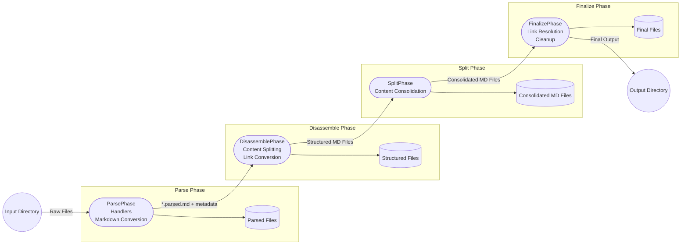
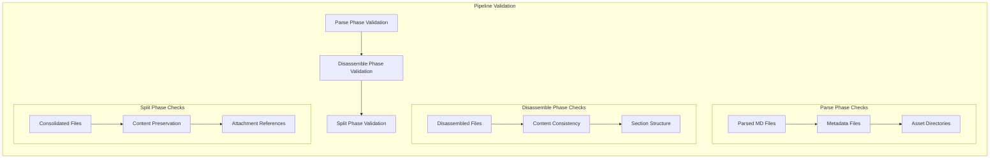

# Nova System Architecture

## Table of Contents
1. [Overview](#overview)
2. [Core Concept & Goals](#core-concept--goals)
3. [Phases & Workflow](#phases--workflow)
    1. [Parse Phase](#parse-phase)
    2. [Disassemble Phase](#disassemble-phase)
    3. [Split Phase](#split-phase)
    4. [Further Phases (Future Roadmap)](#further-phases-future-roadmap)
4. [Key Components](#key-components)
5. [Directory & Filesystem Structure](#directory--filesystem-structure)
6. [Handler Extension Architecture](#handler-extension-architecture)
7. [Error Handling & Logging](#error-handling--logging)
8. [Data Flow & Caching](#data-flow--caching)
9. [Configuration & Environment Setup](#configuration--environment-setup)
10. [Security & Performance Considerations](#security--performance-considerations)
11. [Testing & CI](#testing--ci)
12. [Future Enhancements & Roadmap](#future-enhancements--roadmap)

---

## Overview
Nova is a document-processing pipeline designed to handle various input file types (e.g., PDF, DOCX, images, text, spreadsheets, HTML) and produce interlinked, consolidated Markdown outputs. The system is organized around a **phase-based** architecture, each phase handling a specific concern such as parsing raw inputs or splitting and organizing the processed content.

Nova’s main goals:
1. **Convert** arbitrary file formats into standardized Markdown representations.
2. **Aggregate** relevant content from these files into structured summary documents.
3. **Enhance** the output with additional context (metadata, image analysis, etc.).

---

## Core Concept & Goals
1. **Phase-Oriented Pipeline**  
   Nova uses distinct phases (currently *parse*, *disassemble*, *split*, and *finalize*) to separate the tasks of converting source files into Markdown vs. splitting or reorganizing those Markdown files.

2. **Handler-Based Parsing**  
   Each file type (PDF, DOCX, images, spreadsheets, etc.) is parsed by a specialized *handler*, which extracts text or metadata and then writes a `*.parsed.md` file.  

3. **Configurable & Extensible**  
   Handlers, phases, and other features are all made modular so that new file types, additional phases, or advanced AI-based analyses can be integrated with minimal disruption.

---

## Phases & Workflow
Below is a high-level look at how Nova processes content through its phases:



### Parse Phase
- **Goal**: Convert each input file into a `*.parsed.md` file with metadata
- **Implementation**:
  1. Pipeline enumerates files in input directory
  2. HandlerRegistry matches file extensions to appropriate handlers
  3. Handler processes file and generates:
     - `<filename>.parsed.md`: Main content with metadata header
     - `<filename>.metadata.json`: Extended metadata (if applicable)
     - `<filename>.assets/`: Directory for extracted images/attachments
  4. Console output shows progress bar and handler status
  5. Errors are logged with file paths and handler details

**Output Structure**:
```
_NovaProcessing/
└── phases/
    └── parse/
        ├── document1.parsed.md
        ├── document1.metadata.json
        ├── document1.assets/
        │   └── extracted_image1.png
        ├── image1.parsed.md
        ├── image1.metadata.json
        └── ...
```

### Disassemble Phase
- **Goal**: Process parsed Markdown files into structured sections with consistent reference format
- **Implementation**:
  1. Reads each `*.parsed.md` file from parse phase
  2. Processes content markers and sections:
     - `--==SUMMARY==--`: Content for `<filename>.summary.md`
     - `--==RAW NOTES==--`: Content for `<filename>.raw_notes.md`
     - `--==ATTACHMENTS==--`: Content for `<filename>.attachments.md`
  3. Converts all links to reference format:
     - Regular links: `[ATTACH:TYPE:ID]`
     - Image links: `![ATTACH:TYPE:ID]`
     - Preserves link type based on file extension
  4. Console shows processing progress and link conversion status

**Output Structure**:
```
_NovaProcessing/
└── phases/
    └── disassemble/
        ├── document1.summary.md
        ├── document1.raw_notes.md
        ├── document1.attachments.md
        └── ...
```

### Split Phase
- **Goal**: Consolidate disassembled content into final document structure
- **Implementation**:
  1. Reads all disassembled files from previous phase
  2. Merges content by type:
     - All `*.summary.md` files into `Summary.md`
     - All `*.raw_notes.md` files into `Raw Notes.md`
     - All `*.attachments.md` files into `Attachments.md`
  3. Maintains consistent reference format:
     - Preserves all `[ATTACH:TYPE:ID]` and `![ATTACH:TYPE:ID]` references
     - Updates relative paths for assets
  4. Console shows consolidation progress and merge status

**Output Structure**:
```
_NovaProcessing/
└── phases/
    └── split/
        ├── Summary.md         # Merged summaries with references
        ├── Raw Notes.md       # Merged notes with references
        ├── Attachments.md     # Merged attachments with content
        └── assets/
            └── (consolidated attachments)
```

### Finalize Phase
- **Goal**: Validate pipeline output and create final output with resolved links
- **Implementation**:
  1. Run pipeline validator as initial integrity check
     - Validates all previous phase outputs
     - Ensures content consistency across phases
     - Verifies all references and attachments
     - Aborts finalization if validation fails
  2. Validates all cross-references
  3. Ensures asset paths are correct
  4. Copies final files to output directory
  5. Cleans up temporary processing files
  6. Console shows completion status and any warnings

**Output Structure**:
```
_Nova/
├── Summary.md
├── Raw Notes.md
├── Attachments.md
└── assets/
    └── (final consolidated assets)
```

The finalization phase includes validation as its first step to:
- Catch any issues before modifying the output directory
- Ensure complete pipeline integrity before finalization
- Preserve existing output if validation fails
- Provide early feedback about any problems

This validation can also be run independently via the command line:
```bash
python3 src/nova/validation/pipeline_validator.py /path/to/processing/dir
```

This dual approach (automatic + manual) ensures:
1. Pipeline output is always validated before finalization
2. Users can verify pipeline state at any time
3. CI/CD systems can run validation independently
4. Existing output is preserved if validation fails

### Console Output
The pipeline provides rich console feedback:
- Progress bars for each phase
- File processing status with handler information
- Warning/error messages in color-coded format
- Summary statistics (files processed, errors, timing)
- Detailed logging for debugging (when verbose mode enabled)

### Requirements
- Python 3.9+
- Rich library for console output
- Specific handler requirements:
  - Document Handler: python-docx, PyPDF2
  - Image Handler: Pillow, libheif, Tesseract (for OCR)
  - Audio Handler: ffmpeg-python
  - Archive Handler: python-magic
- Environment variables:
  - `OPENAI_API_KEY`: For AI-powered image analysis
  - `NOVA_CONFIG_PATH`: Optional custom config location
  - `NOVA_LOG_LEVEL`: Control logging verbosity

### Known Constraints & Performance Considerations
- File Size Limits:
  - PDFs: Recommended max 100MB per file
  - Images: Recommended max 20MB per image
  - Memory usage scales with file size
- Performance Bottlenecks:
  - OCR processing is CPU-intensive
  - AI image analysis requires API calls
  - Large archives may need significant temp storage
- Caching Behavior:
  - OCR results are cached to prevent reprocessing
  - AI analysis results are cached with 1-hour TTL
  - Cache can be cleared manually if needed

Further Phases (Future Roadmap)

Nova is designed to allow additional phases to be appended as the pipeline grows. Examples might include:
	•	Phase: Publish
Generate a final distribution package or upload to a documentation site.
	•	Phase: Index
Produce cross-referenced indexes or tables for easy searching.
	•	Phase: AI Summaries
Summarize Raw Notes.md using advanced AI models for short, bullet-point briefs.

Key Components

Pipeline Runner (run_nova.sh / nova.core.pipeline.NovaPipeline)
	•	Single Entry Point for configuring, instantiating, and running the pipeline from the command line.
	•	Coordinates the phases, loads config, handles logging.

Directory Structure
	1.	_NovaProcessing/
Temporary working area for parsed intermediate files, final consolidated MD, and attachments.
	2.	_NovaInput/
Location for raw input files to be processed.
	3.	_Nova/
Final output directory for Summary.md, Raw Notes.md, and Attachments.md.

Handlers
	•	Overview: Each handler focuses on one file type and knows how to convert that type to Markdown. Examples:
	•	DocumentHandler: PDF, DOCX
	•	ImageHandler: JPG, PNG, HEIC
	•	TextHandler: plain text, JSON, XML
	•	SpreadsheetHandler: CSV, XLSX
	•	Registry: HandlerRegistry automatically picks the right handler based on file extension.

Configuration
	•	nova.config
Manages YAML config files, environment variables, caching directories, and file paths.

Directory & Filesystem Structure

The root project folder typically looks like this (simplified):

nova
├── docs/
│   └── architecture.md     # This file 
├── src/
│   └── nova/
│       ├── phases/
│       │   ├── parse.py    # Parse Phase
│       │   ├── split.py    # Split Phase
│       │   └── base.py
│       ├── handlers/       # All file-type handlers
│       ├── config/         # Configuration management
│       ├── core/           # Core pipeline, logging, metadata, metrics
│       ├── models/         # Pydantic or dataclass-based metadata models
│       └── utils/          # Utility functions 
├── tests/
│   └── integration/        # Integration tests for each phase
└── ...

Key Subfolders:
	•	src/nova/phases/: Phase classes (ParsePhase, SplitPhase) implementing the pipeline steps.
	•	src/nova/handlers/: Specialized classes for each file type.
	•	src/nova/models/: Data structures for metadata, including DocumentMetadata.
	•	src/nova/config/: Config loading, environment setup, and caching parameters.
	•	tests/: Unit and integration tests covering handlers, phases, and system-level tests.

Handler Extension Architecture

Handlers manage “reading -> extracting -> converting” data for a file type. Each inherits from BaseHandler:
	1.	Registration: HandlerRegistry maps file extensions to handlers.
	2.	Processing:
	•	process(...) is invoked with a Path, an output_dir, and a DocumentMetadata.
	•	Handler extracts content, writes a *.parsed.md, and updates metadata.processed = True.
	3.	Fallback: If a file extension isn’t recognized, a default or error path is used, adding a note that no handler was found.

A UML-ish representation:

classDiagram
    class BaseHandler {
        <<abstract>>
        +process(file_path, output_dir, metadata) -> DocumentMetadata?
        +process_impl() -> DocumentMetadata? (override)
        #_safe_read_file()
        #_safe_write_file()
    }
    class DocumentHandler {
        +process_impl() -> DocumentMetadata?
        -_extract_pdf_text()
        -_extract_docx_text()
    }
    class ImageHandler {
        +process_impl() -> DocumentMetadata?
        -_get_image_context()
        -_classify_image_type()
        -_write_markdown()
    }
    BaseHandler <|-- DocumentHandler
    BaseHandler <|-- ImageHandler

Error Handling & Logging
	•	Central Exceptions: nova.core.errors defines NovaError, ProcessingError, etc.
	•	Per-Phase & Per-Handler: Each handler or phase can add errors to a DocumentMetadata record with add_error().
	•	Logging:
	•	Rich / Python Logging used for console output, debug logs, and file logs.
	•	Nova logs to nova.log in the base_dir/logs folder with separate console output for immediate feedback.

Data Flow & Caching
	•	Data Flow:
	1.	Input: Raw files placed in _NovaInput.
	2.	Parse: Writes *.parsed.md into _NovaProcessing/phases/parse/<relative-subfolders>.
	3.	Split: Reads those *.parsed.md files, appending text to Summary.md, Raw Notes.md, and listing references in Attachments.md under _NovaProcessing/phases/split/.
	•	Cache:
	•	nova.cache.manager.CacheManager can store partial results (especially for heavy operations like AI-based image analysis) in _NovaCache.
	•	The pipeline checks if cached results are valid or if input files are newer than the cached output.

Configuration & Environment Setup

Nova’s configuration:
	1.	nova.yaml: main config file in config/.
	2.	Environment Variables:
	•	OPENAI_API_KEY needed for ImageHandler AI features.
	•	NOVA_CONFIG_PATH can override the default config path.
	3.	Auto-Generation: Scripts like install.sh or set_env.sh create .env files or directories if missing.

Sample:

base_dir: "${HOME}/Library/Mobile Documents/com~apple~CloudDocs"
input_dir: "${HOME}/Library/Mobile Documents/com~apple~CloudDocs/_NovaInput"
output_dir: "${HOME}/Library/Mobile Documents/com~apple~CloudDocs/_Nova"
processing_dir: "${HOME}/Library/Mobile Documents/com~apple~CloudDocs/_NovaProcessing"

cache:
  dir: "${HOME}/Library/Mobile Documents/com~apple~CloudDocs/_NovaCache"
  enabled: true
  ttl: 3600

Security & Performance Considerations
	1.	Security:
	•	Paths are sanitized to prevent directory traversal.
	•	Handlers do not execute untrusted code or macros from user documents.
	•	OpenAI calls require API keys stored securely in environment variables.
	2.	Performance:
	•	Large PDFs or image files can be memory-intensive. Handlers may handle them in streaming or partial ways in the future.
	•	Caching is used for repeated AI calls on the same images.
	•	Phase-based structure allows partial or incremental reprocessing if only certain files changed.

Testing & CI
	•	Test Layout:
	•	tests/unit/: Unit tests for handlers and utilities.
	•	tests/integration/: End-to-end tests ensuring parse and split phases produce correct *.parsed.md and consolidated outputs.
	•	tests/performance/: (Optional) checks speed or memory usage for large inputs.
	•	Automated:
	•	run_tests.sh uses pytest with pytest.ini or pyproject.toml for configurations.

Future Enhancements & Roadmap
	•	Additional Phases: “Publish” or “Index” to further structure or upload results.
	•	Improved AI Integrations:
	•	Expand ImageHandler to handle bounding boxes, advanced classification, or OCR layouts.
	•	Add advanced text summarization handlers for large documents.
	•	Granular Caching:
	•	Intelligent re-checking so that only changed pages/images are reprocessed.
	•	Live/Interactive:
	•	Possible integration with a web-based UI or event-based triggers (like dropping new files into _NovaInput).

## Error Handling & Logging

### Pipeline Validation

The pipeline includes a robust validation system (`PipelineValidator`) that ensures the integrity of each phase's output:



#### Validation Process
1. **Parse Phase Validation**
   - Verifies presence of `.parsed.md` files
   - Checks for required `.metadata.json` files
   - Validates asset directory structure
   - Tracks attachments for later validation

2. **Disassemble Phase Validation**
   - Ensures content matches parse phase output
   - Validates summary and raw notes files
   - Checks section markers and formatting
   - Handles special cases (errors, encoding issues)

3. **Split Phase Validation**
   - Verifies consolidated file structure
   - Validates content preservation
   - Checks attachment references
   - Ensures section consistency

#### Error Reporting
The validator provides detailed error messages:
- File-level validation failures
- Content mismatches with expected values
- Missing or malformed sections
- Reference integrity issues

#### Usage
```python
validator = PipelineValidator(processing_dir)
is_valid = validator.validate()
```

The validator can be run independently to check pipeline output:
```bash
python3 src/nova/validation/pipeline_validator.py /path/to/processing/dir
```

### Error Handling


