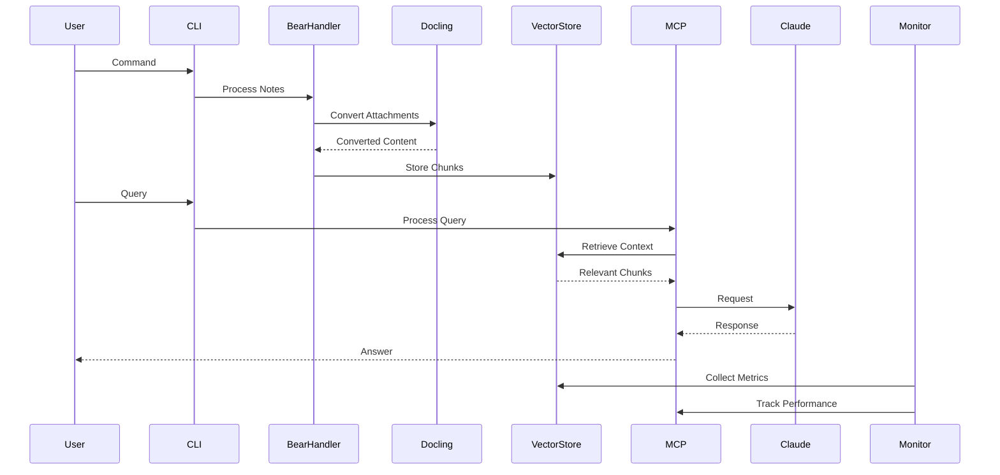

# Nova System Architecture

## Core Architecture Principles

1. **Local-First Design**
   - Primary deployment on user's machine
   - Optional cloud deployment with enhanced security
   - Ephemeral data handling in memory
   - uv-based package management
   - Centralized .nova directory for system files
   - Configurable input directory

2. **Modular Components**
   - Independent service layers
   - Clear interfaces between components
   - Pluggable implementations (e.g., vector stores)

## System Components

### 1. Data Ingestion Layer

#### Bear Export Handler [REFACTORING]
- Leverages docling for document processing:
  + Document conversion pipeline
  + Rich metadata extraction
  + Built-in format detection
  + Native attachment handling

+ Metadata Integration:
  + Use docling's document model
  + Map Bear-specific metadata to docling format
  + Preserve Bear tags in docling metadata

- Tag Integration:
  + Extract tags through docling's text processing
  + Map to Bear tag structure
  + Preserve hierarchical relationships
  + Support nested tags via docling's text model

+ Error Management:
  + Leverage docling's error system
  + Map Bear-specific errors to docling errors
  + Maintain context and logging

+ Attachment Pipeline:
  + Use docling's native attachment handling
  + Leverage docling's format detection
  + Map Bear attachments to docling model
  + Built-in versioning support

#### ~~OCR Integration [REMOVING]~~
- ~~EasyOCR-based text extraction:~~
  - ~~Confidence scoring with 50% threshold~~
  - ~~Multiple OCR configurations for quality/speed tradeoff~~
  - ~~Async processing with fallback mechanisms~~
  - ~~Python 3.10 environment required~~
  - ~~Proper import path: nova.bear_parser.ocr~~
- ~~Error Handling:~~
  - ~~Structured OCR errors with detailed messages~~
  - ~~Placeholder generation for failed OCR:~~
    - ~~JSON format with version tracking~~
    - ~~Original file reference~~
    - ~~Error details and timestamps~~
    - ~~Automatic cleanup after 30 days~~
  - ~~Configurable output to .nova directory:~~
    - ~~Placeholders in .nova/placeholders/ocr~~
    - ~~Processing files in .nova/processing/ocr~~
    - ~~Logs in .nova/logs~~
+ Image Processing:
  + Use docling's built-in image processing
  + Leverage docling's OCR capabilities
  + Native format support
  + Integrated error handling
  + Built-in confidence scoring

### 2. Vector Store Layer [IMPLEMENTED]

#### Chunking Engine [IMPLEMENTED]
- Hybrid chunking strategy:
  - Heading-based segmentation with hierarchy preservation
  - Semantic content splitting with word boundary detection
  - Configurable chunk sizes (min, max, overlap)
- Metadata preservation:
  - Source location tracking
  - Tag inheritance
  - Heading context maintenance
- Content type handling:
  - Markdown-aware processing
  - Structured text support
- Current Status:
  - Core chunking functionality verified
  - Test suite passing
  - Python environment configured
  - Dependencies resolved

#### Embedding Service [IMPLEMENTED]
- Sentence transformer integration:
  - all-MiniLM-L6-v2 model support
  - 384-dimensional embeddings
  - MPS acceleration on macOS
- Batch processing support:
  - Configurable batch sizes
  - Memory-efficient processing
- Embedding caching:
  - Local cache in .nova/vector_store/cache
  - Model-specific caching
  - Cache key generation
  - NumPy array storage format
- Current Status:
  - Core embedding functionality verified
  - Test suite passing
  - Caching system operational
  - Integration with chunking engine verified

#### Vector Store Integration [IMPLEMENTED]
- Chroma-based vector store:
  - Persistent storage in .nova/vectors
  - Metadata preservation with embeddings
  - Efficient vector operations
  - Collection-based organization
  - Automatic ID generation
- Bear note integration:
  - Full note content embeddings
  - Rich metadata storage:
    - Source file path
    - Note title and date
    - Tags
  - Batch processing support
- Directory structure:
  - .nova/vectors/: Chroma database files
  - .nova/processing/: Processed notes
  - .nova/logs/: System logs
- Current Status:
  - Core functionality verified
  - Test suite passing
  - Bear note integration complete
  - Processing scripts operational
  - CLI modules implemented:
    - process-bear-vectors: Bear note vector processing
    - clean-vectors: Vector store cleanup

### 3. RAG Orchestration Layer

#### CLI Architecture [COMPLETED]
- Command Structure:
  - src/nova/cli/
    - main.py: Command dispatcher with dynamic command discovery
    - commands/: Individual command modules with base command class
    - utils/: Shared CLI utilities and error handling
- Core Commands:
  - process-notes:
    - Bear note processing with configurable paths
    - Metadata generation and organization
    - Progress tracking with rich output
    - Async note processing with error recovery
    - Configurable input/output paths
  - process-bear-vectors:
    - Bear note vector processing
    - Chroma vector store integration
    - Metadata preservation
    - Batch processing support
    - Configurable input/output paths
  - clean-vectors:
    - Vector store cleanup
    - Safe deletion with --force flag
    - Directory cleanup
    - Error handling and logging
  - monitor:
    - Health checks and system status
    - Statistics and metrics display
    - Log viewing and filtering
    - Rich table-based output
    - Real-time system monitoring
- Command Registration:
  - Plugin-based architecture with base command class
  - Automatic command discovery and registration
  - Standardized error handling and logging
  - Type-safe command interfaces
  - Click-based command creation
- Console Integration:
  - pyproject.toml entrypoints for nova command
  - Shell completion support
  - Unified error handling with click.Abort
  - Rich terminal output formatting
  - Color-coded status indicators
- Progress Feedback:
  - Rich progress bars for long operations
  - Structured status updates
  - Error reporting with context
  - Color-coded output formatting
  - Operation status tracking
- Error Handling:
  - Input validation with descriptive messages
  - Path existence verification
  - Operation status tracking
  - Recovery suggestions
  - Partial progress preservation
- Testing:
  - Comprehensive unit test suite
  - Integration tests for commands
  - Mock-based testing
  - Click test runner integration
  - Help text verification

#### MCP Integration [PLANNED]
- MCP Server Implementation:
  - Core Components:
    - NovaServer: MCP protocol server implementation
      - Protocol version validation
      - Capability negotiation
      - Initialize/initialized handshake
      - Dynamic tool/resource discovery
    - ResourceManager: File and data access handler
      - JSON Schema definitions
      - Resource change notifications
      - Access control validation
    - ToolRegistry: Vector store tool definitions
      - JSON Schema validation
      - Parameter type checking
      - Dynamic tool registration
      - Tool change notifications
    - PromptManager: Template management system
      - Template validation
      - Context assembly
      - Dynamic updates
  - Implementation Structure:
    - src/nova/mcp/
      - __init__.py: Main entry point
      - server.py: NovaServer implementation
      - resources/: Resource handlers
        - schemas/: JSON Schema definitions
        - handlers/: Resource implementations
      - tools/: Tool implementations
        - schemas/: Tool JSON Schemas
        - handlers/: Tool implementations
      - prompts/: Template definitions
      - errors.py: JSON-RPC error definitions
- Capability Types:
  - Resources:
    - Vector store access:
      - Schema: VectorStoreResource
      - Change notifications
      - Access patterns
    - Note content retrieval:
      - Schema: NoteResource
      - Metadata handling
      - Content streaming
    - Attachment handling:
      - Schema: AttachmentResource
      - Binary data handling
      - MIME type support
    - OCR result access:
      - Schema: OCRResource
      - Confidence scoring
      - Error states
  - Tools:
    - search_documentation:
      - Schema: SearchParams
      - Result format
      - Error codes
    - list_sources:
      - Schema: ListParams
      - Collection format
      - Filter options
    - extract_content:
      - Schema: ExtractParams
      - Format options
      - Error states
    - remove_documentation:
      - Schema: RemoveParams
      - Safety checks
      - Rollback support
  - Prompts:
    - Search templates:
      - Schema validation
      - Variable substitution
    - Content formatting:
      - Output validation
      - Style consistency
    - Error handling:
      - Error templates
      - Recovery hints
    - System instructions:
      - Context validation
      - State tracking
- Protocol Implementation:
  - Handshake Protocol:
    - Version validation
    - Capability negotiation
    - Connection setup
  - Change Notifications:
    - Tool updates
    - Resource changes
    - State transitions
  - Error Handling:
    - JSON-RPC error objects
    - Custom error codes
    - Error context
    - Recovery hints
- Testing Strategy:
  - MCP Inspector Integration:
    - Manual protocol testing
    - Schema validation
    - Tool invocation
    - Resource access
  - Automated Tests:
    - Protocol compliance
    - Schema validation
    - Error handling
    - Performance metrics
- Local Transport:
  - MCP Protocol Implementation:
    - Standard capability exposure
    - Local socket communication
    - Client connection handling
  - Resource Management:
    - Connection lifecycle
    - Memory limits
    - Cleanup routines
- Error Handling:
  - Standard MCP Error Types:
    - Resource access errors
    - Tool execution errors
    - Protocol errors
  - Recovery:
    - Standard retry mechanisms
    - Error reporting
    - State recovery

### 4. Monitoring System [PLANNED]

#### Backend Services
- FastAPI-based server:
  - Health check endpoint
  - Basic metrics display
  - Recent ingestion stats
- Structured Logging:
  - structlog integration
  - Consistent log format
  - Log rotation and cleanup
- Metrics Collection:
  - Vector store statistics
  - Query performance tracking
  - System health monitoring
- API Endpoints:
  - /health: System status
  - /metrics: Performance data
  - /stats: Processing statistics

#### Performance Monitoring
- Resource Usage:
  - Memory consumption
  - CPU utilization
  - Disk space tracking
- Operation Metrics:
  - Ingestion throughput
  - Query latency
  - Vector store performance
- Error Tracking:
  - Failure rates
  - Error patterns
  - Recovery success

## Data Flow Architecture

## Development Architecture

### Environment Management
- uv-based dependency management:
  - pyproject.toml for package metadata
  - uv.lock for dependency locking
  - Virtual environment isolation
- Setup Process:
  1. Install uv: `brew install uv` or `pip install uv`
  2. Initialize environment: `uv venv`
  3. Install dependencies: `uv sync`
  4. Activate environment: `source .venv/bin/activate`

### Testing Strategy
- Test Organization:
  - tests/unit/: Unit tests by module
  - tests/integration/: Cross-module tests
  - tests/e2e/: End-to-end workflows
- Test Runner:
  - pytest with verbose output
  - Type checking with mypy
  - Command: `uv run mypy src tests && uv run pytest -v`

### Documentation Structure
- README.md:
  - Quick start guide
  - Environment setup
  - Command reference
- docs/architecture/: Technical design
- docs/prd/: Product requirements
- Developer guide:
  - Setup instructions
  - Testing procedures
  - Contribution guidelines

## Security Architecture

### Local Deployment
- Minimal authentication required
- File system security
- Memory-only ephemeral data
- Secure API key handling

### Cloud Deployment (Optional)
- Token-based authentication
- TLS encryption
- Secure ephemeral data handling
- Access control

## Performance Architecture

### Optimization Strategies
1. Efficient chunking algorithms
2. Batch processing for embeddings
3. Vector store indexing optimization
4. Response streaming
5. Caching layers

### Resource Management
1. Memory-efficient data structures
2. Garbage collection optimization
3. Connection pooling
4. Batch operations

## Error Handling Architecture

### Failure Modes
1. Conversion failures
   - OCR processing errors
   - Image quality issues
   - Unsupported file formats
2. OCR errors
   - Low confidence scores
   - Failed text extraction
   - Image preprocessing failures
3. API rate limits
4. Network issues
5. Storage errors

### Recovery Strategies
1. Fallback mechanisms
   - Alternative OCR approaches
   - Placeholder content generation
   - Metadata preservation
2. Retry policies
3. Circuit breakers
4. Error logging
5. User notifications

## Testing Architecture

### Test Layers
1. Unit tests per component
2. Integration tests between layers
3. End-to-end system tests

### Test Infrastructure
1. Local test runners
2. Test data management

### Not In Scope
The following testing aspects are explicitly NOT included in the current architecture:
1. CI/CD pipelines
2. Code coverage tracking
3. Performance profiling
4. Security audits
5. Automated benchmarking

Our testing focus is on maintaining functionality through regular local testing during development.

## Deployment Architecture

### Local Setup
1. uv environment management
2. Configuration management
   - Input directory configuration
   - API keys and credentials
   - Vector store settings
3. File System Structure
   - .nova directory for all system files
     - Logs directory
     - Processing files
     - Vector store data
     - System state
   - Configurable input directory
     - Default: ~/Library/Mobile Documents/com~apple~CloudDocs/_NovaInput
     - Bear.app exports
     - Attachments
4. Local services

### Cloud Setup (Optional)
1. Container orchestration
2. Service scaling
3. Monitoring integration
4. Backup strategies

## Future Extensibility

### Integration Points
1. Alternative vector stores
2. Different LLM providers
3. Additional file formats
4. Enhanced monitoring

### Scalability Paths
1. Distributed processing
2. Enhanced caching
3. Load balancing
4. Horizontal scaling

## Command-Line Interface

The system provides a unified command-line interface through the `nova` command with the following subcommands:

### Bear Note Processing
- `nova generate-metadata`: Generates metadata.json for Bear notes
  - Creates structured metadata for all notes
  - Extracts creation/modification dates
  - Maps attachment references
  - Builds initial tag list

- `nova process-notes`: Processes Bear notes using the parser
  - Parses all notes in configured input directory
  - Extracts tags with nested support
  - Processes image attachments with OCR
  - Generates OCR failure placeholders
  - Creates structured output in .nova directory

### Vector Store Processing
- `nova process-vectors`: Standalone vector store processing
  - Input: Raw text and output directory
  - Performs heading-aware document chunking
  - Generates embeddings with caching
  - Saves chunks and embeddings to specified directory

- `nova process-bear-vectors`: Bear note vector store integration
  - Input: Bear notes directory and output directory
  - Combines Bear parsing with vector store processing
  - Preserves metadata through processing pipeline
  - Creates note-specific output directories
  - Maintains heading context in chunks

All commands support:
- Configurable input/output paths
- Logging with customizable levels
- Error recovery and reporting
- Progress tracking for long operations
