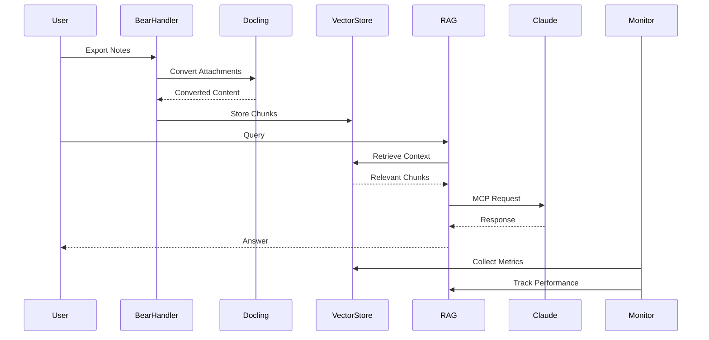

# Nova System Architecture

## Core Architecture Principles

1. **Local-First Design**
   - Primary deployment on user's machine
   - Optional cloud deployment with enhanced security
   - Ephemeral data handling in memory
   - uv-based package management
   - Centralized .nova directory for system files
   - Configurable input directory

2. **Modular Components**
   - Independent service layers
   - Clear interfaces between components
   - Pluggable implementations (e.g., vector stores)

## System Components

### 1. Data Ingestion Layer

#### Bear Export Handler [IMPLEMENTED]
- Processes Bear.app exports (Markdown + attachments)
- Maintains link integrity and metadata
- Handles file organization and structure
- Tag Processing:
  - Code block-aware extraction
  - Metadata validation
  - Punctuation handling
  - Nested tag support (#tag/subtag)
  - Tag inheritance from metadata
- Error Handling:
  - Hierarchical error system (BearParserError, AttachmentError, OCRError)
  - Specific error types with context
  - Graceful degradation with logging
- Attachment Management:
  - Image detection (.png, .jpg, .jpeg, .gif, .bmp)
  - Metadata handling with versioning
  - OCR integration with EasyOCR
- Current Status:
  - Core parsing functionality verified
  - Metadata generation working
  - Tag extraction operational
  - OCR pipeline ready
  - Test suite passing
  - Python environment configured
  - Dependencies resolved
  - Placeholder system operational

#### Docling Integration
- Converts attachments to text/markdown
- OCR capabilities for images:
  - TesseractOcrModel integration (implemented)
  - Confidence scoring with 50% threshold
  - Multiple OCR configurations:
    - Default: bitmap_area_threshold=0.1
    - High-quality: bitmap_area_threshold=0.05
    - Fast: bitmap_area_threshold=0.2
  - Async processing with fallback mechanisms
  - Python 3.10 environment required
  - Proper import path: docling.models.tesseract_ocr_model
- Error Handling:
  - Structured OCR errors with detailed messages
  - Placeholder generation for failed OCR:
    - JSON format with version tracking
    - Original file reference
    - Error details and timestamps
    - Automatic cleanup after 30 days
  - Configurable output to .nova directory:
    - Placeholders in .nova/placeholders/ocr
    - Processing files in .nova/processing/ocr
    - Logs in .nova/logs
- Current Status:
  - Core OCR functionality verified
  - Test suite passing
  - Python environment configured
  - Dependencies resolved
  - Placeholder system operational

### 2. Vector Store Layer

#### Chunking Engine
- Hybrid chunking strategy:
  - Heading-based segmentation
  - Semantic content splitting
  - Configurable chunk sizes
- Metadata preservation
- Content type handling

#### Embedding Service
- Sentence transformer integration
- Batch processing support
- Embedding caching
- Vector normalization

#### Vector Store
- FAISS/Chroma implementation
- Dual storage architecture:
  - Persistent store for permanent data
  - Ephemeral store for temporary data
- Similarity search optimization
- Index management

### 3. RAG Orchestration Layer

#### Query Processor
- MCP-aware query handling:
  - Tool-based query decomposition
  - Context window management
  - Source attribution tracking
- Retrieval Strategy:
  - Hybrid search (semantic + keyword)
  - Configurable chunk selection
  - Dynamic context assembly
- Result Processing:
  - Source validation
  - Metadata enrichment
  - Context relevance scoring

#### MCP Integration
- Official MCP Python SDK implementation
- Tool Definitions:
  - search_documentation: Vector-based search through notes
  - list_sources: Display available note collections
  - extract_content: Process and analyze note content
  - remove_documentation: Delete specific notes/attachments
- Context Block Structure:
  - Ephemeral blocks for sensitive content
  - Resource blocks for persistent data
  - System instruction blocks for Claude guidance
- Transport Layer:
  - Local IPC communication
  - Async/await pattern for operations
  - Proper resource cleanup
- Error Handling:
  - Graceful degradation on failures
  - Clear error messages to Claude
  - Automatic retries for transient issues

#### Claude Interface
- Anthropic API integration via official SDK
- MCP-compliant message formatting:
  - Structured context assembly
  - Tool result integration
  - Ephemeral data management
- Response Handling:
  - Streaming support for long responses
  - Rate limit management
  - Error recovery
- Session Management:
  - Conversation context tracking
  - Tool state persistence
  - Resource cleanup

### 4. Monitoring System

#### Backend Services
- Metrics collection
- Performance tracking
- Log aggregation
- Health checks

#### Web Dashboard
- System metrics display
- Processing status
- Error reporting
- Performance graphs

## Data Flow Architecture

## Security Architecture

### Local Deployment
- Minimal authentication required
- File system security
- Memory-only ephemeral data
- Secure API key handling

### Cloud Deployment (Optional)
- Token-based authentication
- TLS encryption
- Secure ephemeral data handling
- Access control

## Performance Architecture

### Optimization Strategies
1. Efficient chunking algorithms
2. Batch processing for embeddings
3. Vector store indexing optimization
4. Response streaming
5. Caching layers

### Resource Management
1. Memory-efficient data structures
2. Garbage collection optimization
3. Connection pooling
4. Batch operations

## Error Handling Architecture

### Failure Modes
1. Conversion failures
   - OCR processing errors
   - Image quality issues
   - Unsupported file formats
2. OCR errors
   - Low confidence scores
   - Failed text extraction
   - Image preprocessing failures
3. API rate limits
4. Network issues
5. Storage errors

### Recovery Strategies
1. Fallback mechanisms
   - Alternative OCR approaches
   - Placeholder content generation
   - Metadata preservation
2. Retry policies
3. Circuit breakers
4. Error logging
5. User notifications

## Testing Architecture

### Test Layers
1. Unit tests per component
2. Integration tests between layers
3. End-to-end system tests

### Test Infrastructure
1. Local test runners
2. Test data management

### Not In Scope
The following testing aspects are explicitly NOT included in the current architecture:
1. CI/CD pipelines
2. Code coverage tracking
3. Performance profiling
4. Security audits
5. Automated benchmarking

Our testing focus is on maintaining functionality through regular local testing during development.

## Deployment Architecture

### Local Setup
1. uv environment management
2. Configuration management
   - Input directory configuration
   - API keys and credentials
   - Vector store settings
3. File System Structure
   - .nova directory for all system files
     - Logs directory
     - Processing files
     - Vector store data
     - System state
   - Configurable input directory
     - Default: ~/Library/Mobile Documents/com~apple~CloudDocs/_NovaInput
     - Bear.app exports
     - Attachments
4. Local services

### Cloud Setup (Optional)
1. Container orchestration
2. Service scaling
3. Monitoring integration
4. Backup strategies

## Future Extensibility

### Integration Points
1. Alternative vector stores
2. Different LLM providers
3. Additional file formats
4. Enhanced monitoring

### Scalability Paths
1. Distributed processing
2. Enhanced caching
3. Load balancing
4. Horizontal scaling
