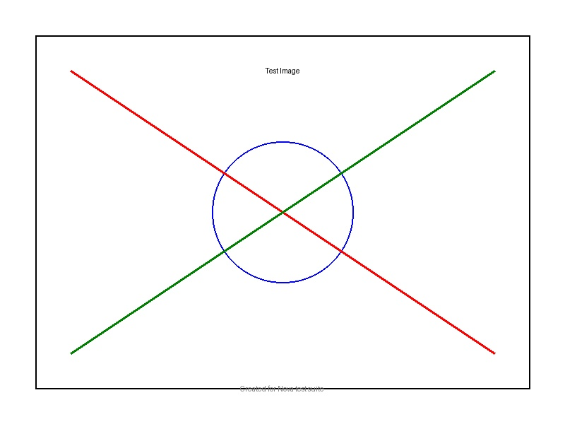

# Document with Images

This document contains various image references and attachments for testing Nova's image handling.

## Screenshots

Here are some test screenshots:

*Caption: A test screenshot*

*Caption: A HEIC format image*

## Embedded Content

1. PDF Reference
   
   See the [full document](../documents/sample.pdf) for details.

2. Mixed Content
   - Image with link: 
   - Reference style: ![Alt text][ref1]

[ref1]: ../images/test.jpg "Reference style image"

## Notes

The images above should be:
- Converted to appropriate formats
- Stored in the assets directory
- Referenced using ATTACH syntax

---
Last updated: 2024-01-03 